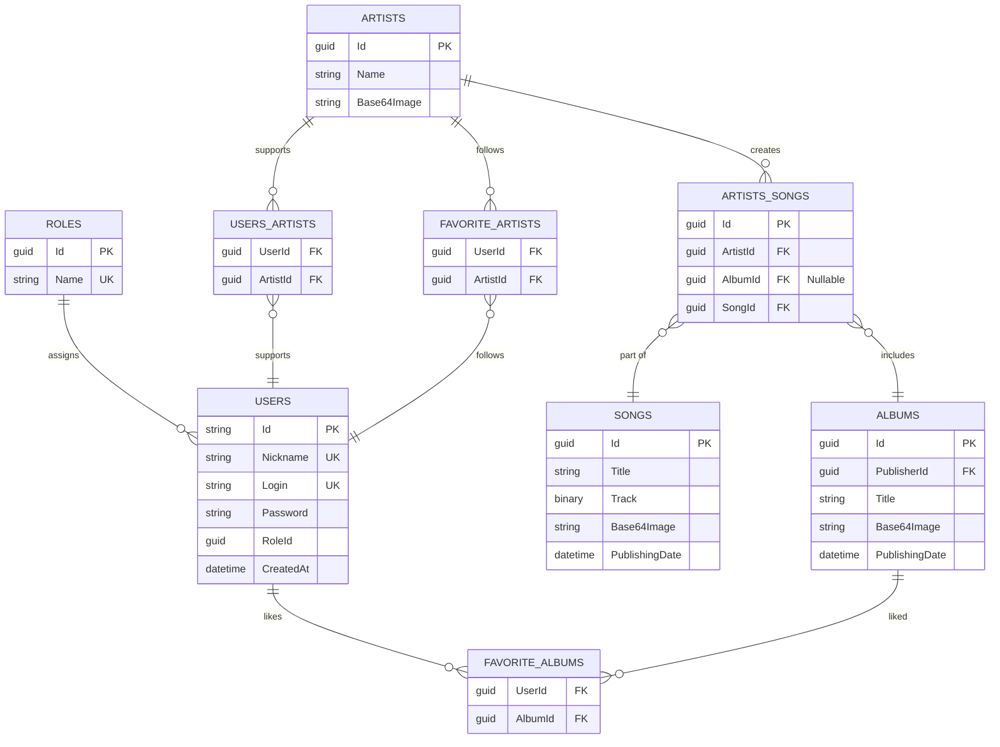

# restful-music-service
RESTful service for music app

Database entity relationship diagram:  

```mermaid
erDiagram   
    ROLES {
        guid Id PK
        string Name UK
    }
    USERS {
        string Id PK
        string Nickname UK
        string Login UK
        string Password
        guid RoleId
        datetime CreatedAt
    }
    ARTISTS {
        guid Id PK
        string Name
        string Base64Image
    }
    SONGS {
        guid Id PK
        string Title
        binary Track
        string Base64Image
        datetime PublishingDate
    }
    ALBUMS {
        guid Id PK
        guid PublisherId FK
        string Title
        string Base64Image
        datetime PublishingDate
    }
    USERS_ARTISTS {
        guid UserId FK
        guid ArtistId FK
    }
    FAVORITE_ARTISTS {
        guid UserId FK
        guid ArtistId FK
    }
    FAVORITE_ALBUMS {
        guid UserId FK
        guid AlbumId FK
    }
    ARTISTS_SONGS {
        guid Id PK
        guid ArtistId FK
        guid AlbumId FK "Nullable"
        guid SongId FK
    }

    ROLES ||--o{ USERS : "assigns"

    ARTISTS ||--o{ USERS_ARTISTS : "supports"
    USERS_ARTISTS }o--|| USERS : "supports"

    ARTISTS ||--o{ FAVORITE_ARTISTS : "follows"
    FAVORITE_ARTISTS }o--|| USERS : "follows"

    USERS ||--o{ FAVORITE_ALBUMS : "likes"
    ALBUMS ||--o{ FAVORITE_ALBUMS : "liked"

    ARTISTS ||--o{ ARTISTS_SONGS : "creates"
    ARTISTS_SONGS }o--|| ALBUMS : "includes"
    ARTISTS_SONGS }o--|| SONGS : "part of"
```